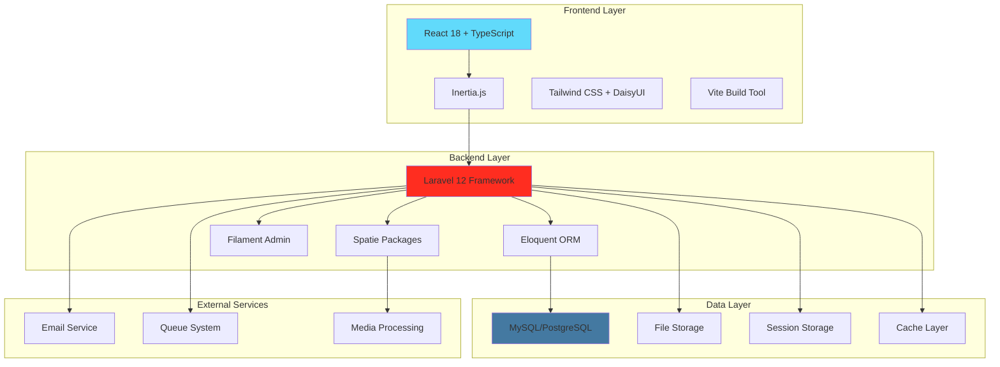
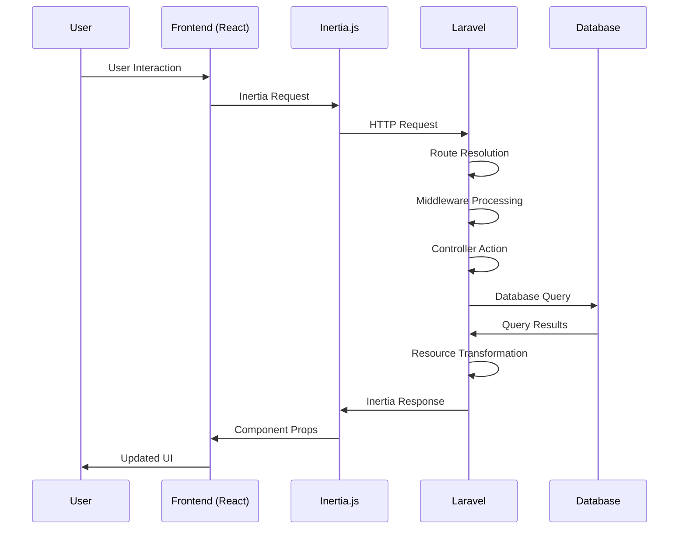
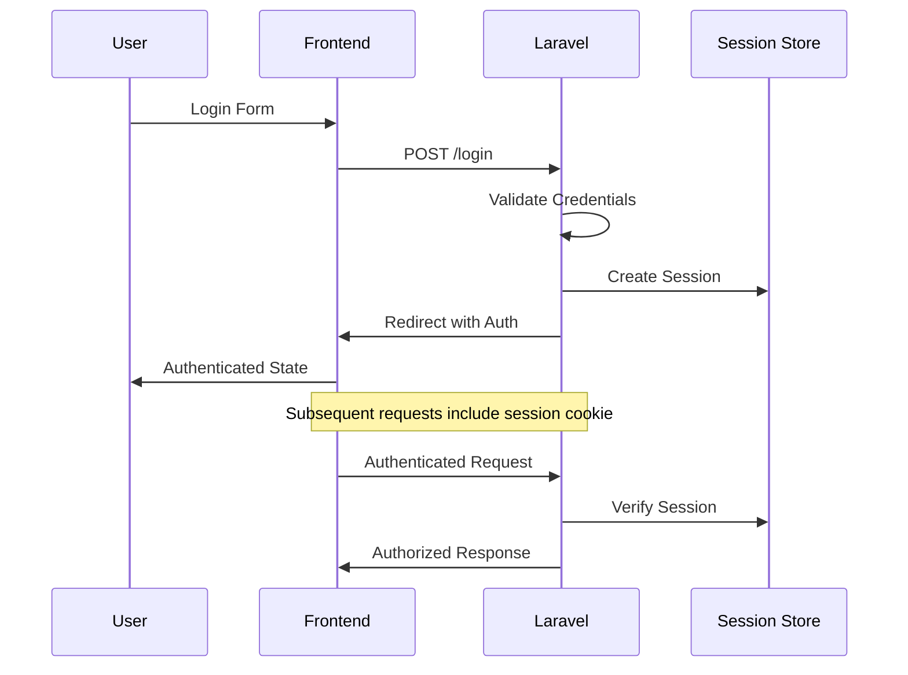

# System Architecture

## Overview

This Laravel React e-commerce platform follows a modern full-stack architecture with clear separation of concerns, leveraging the best practices of both Laravel and React ecosystems.

## Architecture Diagram



## Technology Stack

### Frontend Technologies

#### React 18 with TypeScript
- **Component-based architecture** for reusable UI elements
- **TypeScript integration** for type safety and better developer experience
- **Hooks-based state management** for local component state
- **Server-side rendering (SSR)** support via Inertia.js

#### Inertia.js
- **SPA-like experience** without the complexity of a separate API
- **Server-driven routing** with client-side navigation
- **Automatic CSRF protection** and authentication state management
- **Progressive enhancement** with graceful fallbacks

#### Styling Framework
- **Tailwind CSS**: Utility-first CSS framework for rapid development
- **DaisyUI**: Component library built on Tailwind for consistent UI
- **Responsive design**: Mobile-first approach with breakpoint utilities
- **Custom component system**: Reusable React components with consistent styling

#### Build Tools
- **Vite**: Fast build tool with hot module replacement
- **TypeScript compiler**: Type checking and compilation
- **PostCSS**: CSS processing and optimization
- **Laravel Vite Plugin**: Seamless integration with Laravel

### Backend Technologies

#### Laravel 12 Framework
- **MVC Architecture**: Clear separation of concerns
- **Eloquent ORM**: Object-relational mapping with active record pattern
- **Artisan CLI**: Command-line interface for development tasks
- **Service Container**: Dependency injection and service resolution

#### Key Laravel Packages

##### Spatie Media Library
- **File upload management** with automatic conversions
- **Multiple file formats** support (images, documents, videos)
- **Responsive images** with multiple size variants
- **Custom path generation** for organized file storage

##### Spatie Permission
- **Role-based access control (RBAC)** system
- **Granular permissions** for fine-tuned access control
- **Guard-based permissions** for different authentication systems
- **Caching** for performance optimization

##### Laravel Breeze
- **Authentication scaffolding** with modern practices
- **Password reset** and email verification
- **Remember me** functionality
- **Rate limiting** for security

#### Filament Admin Panel
- **Modern admin interface** built with Livewire and Alpine.js
- **Resource management** with CRUD operations
- **Form builder** with validation and field types
- **Table builder** with filtering, sorting, and pagination
- **Dashboard widgets** for analytics and quick actions

### Database Layer

#### Database Management
- **MySQL/PostgreSQL** support with Laravel's database abstraction
- **Migration system** for version-controlled schema changes
- **Seeding system** for consistent test data
- **Query builder** with fluent interface

#### Data Modeling
- **Eloquent Models** with relationships and scopes
- **Model factories** for testing and seeding
- **Observers** for model event handling
- **Soft deletes** for data integrity

## Application Layers

### Presentation Layer (Frontend)

```
resources/js/
├── Components/          # Reusable UI components
│   ├── Core/           # Basic UI elements (buttons, inputs, etc.)
│   └── App/            # Application-specific components
├── Layouts/            # Page layout components
├── Pages/              # Page-level components
└── types/              # TypeScript type definitions
```

**Responsibilities:**
- User interface rendering
- User interaction handling
- Client-side validation
- State management (local)
- Navigation and routing (client-side)

### Application Layer (Backend)

```
app/
├── Http/
│   ├── Controllers/    # Request handling and response formatting
│   ├── Middleware/     # Request/response filtering
│   ├── Requests/       # Form request validation
│   └── Resources/      # API resource transformation
├── Models/             # Data models and business logic
├── Services/           # Business logic services
├── Enums/             # Application constants and enums
└── Filament/          # Admin panel resources
```

**Responsibilities:**
- Business logic implementation
- Request validation and processing
- Authentication and authorization
- Data transformation and serialization
- External service integration

### Data Layer

```
database/
├── migrations/         # Database schema definitions
├── seeders/           # Sample data generation
└── factories/         # Model factories for testing
```

**Responsibilities:**
- Data persistence and retrieval
- Data integrity and constraints
- Query optimization
- Transaction management

## Design Patterns

### Model-View-Controller (MVC)
- **Models**: Eloquent models handle data logic and relationships
- **Views**: React components render the user interface
- **Controllers**: Laravel controllers handle HTTP requests and responses

### Repository Pattern (Implicit)
- Eloquent models act as repositories for data access
- Service classes handle complex business logic
- Resource classes transform data for API responses

### Observer Pattern
- Model observers for handling model events
- Event listeners for application-wide events
- Queue jobs for asynchronous processing

### Factory Pattern
- Model factories for creating test data
- Service providers for dependency injection
- Resource factories for API transformations

## Data Flow

### Request Lifecycle



### Authentication Flow



## Security Architecture

### Authentication & Authorization
- **Session-based authentication** with CSRF protection
- **Role-based access control** via Spatie Permission
- **Route protection** with middleware
- **Form request validation** for input sanitization

### Data Protection
- **Mass assignment protection** in Eloquent models
- **SQL injection prevention** via query builder
- **XSS protection** through proper output escaping
- **File upload validation** and sanitization

### Infrastructure Security
- **Environment variable protection** for sensitive data
- **Rate limiting** for API endpoints
- **HTTPS enforcement** in production
- **Security headers** configuration

## Performance Optimization

### Frontend Optimization
- **Code splitting** with dynamic imports
- **Asset optimization** via Vite
- **Image lazy loading** and responsive images
- **Component memoization** for expensive renders

### Backend Optimization
- **Database query optimization** with eager loading
- **Caching strategies** for frequently accessed data
- **Queue processing** for time-consuming tasks
- **Database indexing** for query performance

### Infrastructure Optimization
- **CDN integration** for static assets
- **Database connection pooling**
- **Redis caching** for session and application data
- **Horizontal scaling** capabilities

## Scalability Considerations

### Horizontal Scaling
- **Stateless application design** for load balancing
- **Database read replicas** for query distribution
- **Queue workers** for background processing
- **Microservice architecture** potential for future growth

### Vertical Scaling
- **Database optimization** and indexing
- **Memory usage optimization** in PHP
- **CPU-intensive task optimization**
- **Storage optimization** for media files

## Development Workflow

### Local Development
```bash
# Start all development services
composer run dev

# Individual services
php artisan serve          # Laravel development server
php artisan queue:listen   # Queue worker
npm run dev               # Vite development server
```

### Testing Strategy
- **Unit tests** for business logic
- **Feature tests** for HTTP endpoints
- **Browser tests** for user workflows
- **Database testing** with transactions

### Deployment Pipeline
- **Environment configuration** management
- **Database migrations** automation
- **Asset compilation** and optimization
- **Queue worker** management
- **Cache warming** strategies

## Monitoring and Logging

### Application Monitoring
- **Laravel Telescope** for development debugging
- **Log aggregation** for production monitoring
- **Performance metrics** collection
- **Error tracking** and alerting

### Database Monitoring
- **Query performance** analysis
- **Connection pool** monitoring
- **Storage usage** tracking
- **Backup verification**

This architecture provides a solid foundation for a scalable, maintainable e-commerce platform while maintaining flexibility for future enhancements and integrations.