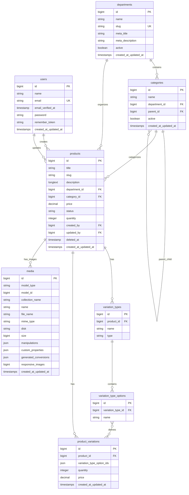

# Database Structure

## Overview

The database is designed to support a multi-vendor e-commerce platform with hierarchical product categorization, flexible product variations, and comprehensive user management.

## Entity Relationship Diagram



## Table Descriptions

### Core Tables

#### `users`
Stores user information with role-based access control via Spatie Permission package.

**Key Features:**
- Email verification support
- Password hashing
- Remember token for "remember me" functionality
- Integration with Spatie Permission for roles and permissions

**Relationships:**
- Has many products (as creator and updater)
- Has roles and permissions (via Spatie Permission)

#### `departments`
Top-level product organization (e.g., Electronics, Clothing, Home & Garden).

**Key Features:**
- SEO-friendly slugs
- Meta tags for SEO
- Active/inactive status
- Unique slug constraint

**Relationships:**
- Has many categories
- Has many products

#### `categories`
Hierarchical product categorization within departments.

**Key Features:**
- Self-referencing for parent-child relationships
- Department association
- Active/inactive status
- Supports unlimited nesting levels

**Relationships:**
- Belongs to department
- Belongs to parent category (self-referencing)
- Has many child categories
- Has many products

#### `products`
Core product information and inventory management.

**Key Features:**
- Rich text descriptions
- SEO-friendly slugs
- Price with high precision (20,4)
- Status management (draft, published)
- Soft deletes
- Audit trail (created_by, updated_by)
- Inventory tracking

**Relationships:**
- Belongs to department
- Belongs to category
- Belongs to user (creator and updater)
- Has many variation types
- Has many product variations
- Has many media files

### Product Variation System

#### `variation_types`
Defines the types of variations a product can have (e.g., Size, Color, Material).

**Key Features:**
- Product-specific variation types
- Type classification for UI rendering
- Cascade delete with products

**Relationships:**
- Belongs to product
- Has many variation type options

#### `variation_type_options`
Specific options for each variation type (e.g., Small, Medium, Large for Size).

**Key Features:**
- Belongs to specific variation type
- Cascade delete with variation types

**Relationships:**
- Belongs to variation type
- Referenced by product variations

#### `product_variations`
Specific combinations of variation options with their own pricing and inventory.

**Key Features:**
- JSON storage for variation option combinations
- Individual pricing (overrides base product price)
- Individual inventory tracking
- Flexible combination support

**Example JSON structure:**
```json
{
  "variation_type_option_ids": [1, 5, 8]
}
```

**Relationships:**
- Belongs to product
- References multiple variation type options

### Supporting Tables

#### `media`
File storage and management via Spatie Media Library.

**Key Features:**
- Polymorphic relationship (can attach to any model)
- Multiple collections per model
- Automatic image conversions (thumb, small, large)
- Custom properties and manipulations
- Responsive images support

**Conversions:**
- `thumb`: 100px width
- `small`: 480px width  
- `large`: 1200px width

#### Authentication Tables

- `password_reset_tokens`: Password reset functionality
- `sessions`: Session management
- `cache`: Application caching
- `jobs`: Queue job management

#### Permission Tables (Spatie Permission)

- `roles`: User roles (Admin, Vendor, User)
- `permissions`: Granular permissions
- `model_has_permissions`: Direct user permissions
- `model_has_roles`: User role assignments
- `role_has_permissions`: Role permission assignments

## Indexes and Performance

### Primary Indexes
- All tables have auto-incrementing primary keys
- Foreign key constraints with proper indexing

### Secondary Indexes
- `departments.slug` - Unique index for SEO URLs
- `categories.department_id` - Foreign key index
- `categories.parent_id` - Foreign key index
- `products.department_id` - Foreign key index
- `products.category_id` - Foreign key index
- `products.status` - Query optimization for published products
- `products.created_by` - Vendor product filtering
- `variation_types.product_id` - Product variation queries
- `variation_type_options.variation_type_id` - Option lookups
- `product_variations.product_id` - Product variation queries

## Data Integrity

### Foreign Key Constraints
- All relationships enforced at database level
- Cascade deletes where appropriate:
  - Product deletion cascades to variations and variation types
  - Variation type deletion cascades to options

### Validation Rules
- Email uniqueness in users table
- Slug uniqueness in departments table
- Required fields enforced at application level
- Price precision maintained with decimal(20,4)

## Seeding Strategy

The database includes comprehensive seeders:

1. **RoleSeeder**: Creates Admin, Vendor, and User roles
2. **UserSeeder**: Creates default admin user
3. **DepartmentSeeder**: Sample departments with SEO data
4. **CategorySeeder**: Hierarchical categories for each department

## Migration Timeline

1. `0001_01_01_000000` - Core Laravel tables (users, sessions, cache, jobs)
2. `2025_06_17_165944` - Spatie Permission tables
3. `2025_06_18_164859` - Departments table
4. `2025_06_19_041950` - Categories table
5. `2025_06_19_050252` - Products table
6. `2025_06_19_120339` - Media library tables
7. `2025_06_19_190956` - Product variations system

## Query Examples

### Common Queries

```sql
-- Get all published products with their categories and departments
SELECT p.*, c.name as category_name, d.name as department_name
FROM products p
JOIN categories c ON p.category_id = c.id
JOIN departments d ON p.department_id = d.id
WHERE p.status = 'published'
AND p.deleted_at IS NULL;

-- Get product variations with their option names
SELECT pv.*, 
       GROUP_CONCAT(vto.name) as variation_options
FROM product_variations pv
JOIN products p ON pv.product_id = p.id
JOIN variation_type_options vto ON JSON_CONTAINS(pv.variation_type_option_ids, CAST(vto.id AS JSON))
WHERE p.id = 1
GROUP BY pv.id;

-- Get category hierarchy
WITH RECURSIVE category_tree AS (
    SELECT id, name, parent_id, 0 as level
    FROM categories
    WHERE parent_id IS NULL
    
    UNION ALL
    
    SELECT c.id, c.name, c.parent_id, ct.level + 1
    FROM categories c
    JOIN category_tree ct ON c.parent_id = ct.id
)
SELECT * FROM category_tree ORDER BY level, name;
```

## Performance Considerations

1. **Indexing**: All foreign keys and frequently queried columns are indexed
2. **Pagination**: Large product lists use Laravel's pagination
3. **Eager Loading**: Relationships are eager loaded to prevent N+1 queries
4. **Caching**: Consider implementing Redis for frequently accessed data
5. **Image Optimization**: Media conversions reduce bandwidth usage
6. **Soft Deletes**: Products use soft deletes for data integrity

## Backup and Maintenance

- Regular database backups recommended
- Monitor query performance with slow query logs
- Consider archiving old soft-deleted records
- Regular maintenance of media files and unused conversions